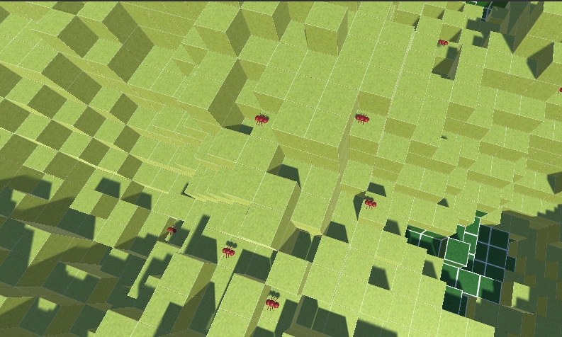

# Assignment 3: Antymology

This goal of this assignment is to simulate an ant colony behaviour in a random environment with different type of blocks, which could correspond to different biomes in real life.

## Goal

We will model a basic set of behaviours and then use a neural network or an evolutionary algorithm to maximises the nest production.

### Agents

We have several normal/worker ants and one ant queen which she can do something no one else can which is placing nest blocks.

The ants will have the following set of behaviours:

- When an ants health hits 0, it dies.
- Every timestep, each ants health is decreased by some fixed amount.
- Ants can refill their health by consuming Mulch blocks.
- Ants cannot consume mulch if another ant is also on the same mulch block.
- Ants are not allowed to move to a block that is greater than 2 units in height difference.
- Ants are able to dig up parts of the world.
- Ants cannot dig up a block of type ContainerBlock.
- Ants standing on an AcidicBlock will have the rate at which their health decreases multiplied by 2.
- Ants may give some of their health to other ants occupying the same space.
- There exists a singular queen ant who is responsible for producing nest blocks.
- Producing a single nest block costs the queen 1/3rd of her maximum health.
- No new ants will be created during each evaluation phase.

### Approach

Although my project is far from finished I did my best to implement the above set of behviours in the ants.

I first modeled the ant prefab inside Unity and then added a skeleton AntBehaviour script to the model.

Then inside the WorldManager.cs I implemented the GenerateAnt function to generate the ants inside the environment.

I then added the movement function to the AntBehaviour.cs which will choose a random position from all the available positions for the ant to move to.

Then I added Mulch consumption, HealthUpdate and DigUp fucntions which made the ants more ant like.

The next steps that I need to take are finishing up the basic behaviors and move to implementing the evolutionary algorithm which is no longer possible due health issues and time constraints.

 

